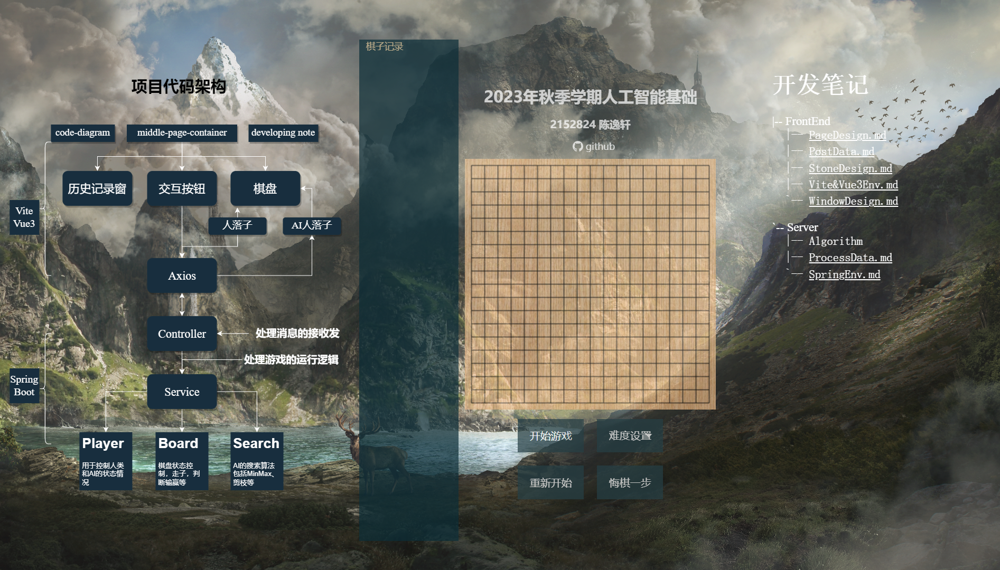

**content**
- [1. Background](#1-background)
  - [basic](#basic)
  - [site](#site)
  - [heuristic](#heuristic)
- [2. Introduciton](#2-introduciton)
  - [技术路线](#技术路线)
  - [项目结构](#项目结构)
- [3. Running](#3-running)
  - [后端设置](#后端设置)
  - [前端设置](#前端设置)
- [4. Doc](#4-doc)
- [License](#license)

## 1. Background
2023年秋季学期同济大学自动化专业人工智能课程大作业

### basic

**功能要求**
- 以 19*19 的网格围棋棋盘为黑白两方的战场，黑白两方分别由算法模块和人控制，棋盘状态为双方均可访问的共享数据，按五子棋规则进行对弈；
- 对弈决策（走子决策）来自基本的 MIN-MAX 搜索（或对抗搜索、博弈搜索）
- 为简单起见，可以采用命令行界面进行输入输出，每次走子后，以字符形式在屏幕上打印棋盘当前最新状态。走子时输入两个数，指明落子的横纵坐标位置。
- 执黑先行。胜负按照五子棋规则进行。
- 本次开发实验的算法和代码追求最简，不准复杂化，要考虑整个算法和程序能跑起来的最简单情况是什么，以求把握搜索的要点。

### site
- 开发一个对战平台服务端，对外以RESTful接口（API）形式提供服务；
- 允许各种语言开发的各种计算机棋手通过服务端的API连入服务端，服务端将走子记入数据库供对手查询和后续数据分析。各计算机棋手可以把服务端当成是一- 个公共的数据区。
- 开发一个专门在服务端运行的计算机棋手，这样，学生只需要开发一个计算机棋手程序即可与服务端对弈，以及支持人机（机指服务端的棋手程序）对弈。
- 服务端能够记录每个棋手每一步走子的记录用于后续分析棋力等指标。
- 给出棋力评估的经验方法

### heuristic
- 在gobang-basic基础上，向前至少搜索2-3步或2个回合
- 通过剪枝策略缩小搜索空间，使得整个程序的性能可满足人机对弈对响应时间的容忍程度。
- 在决定如何剪枝时可以考虑引入人类棋手经验，形成启发式规则和决策，指导剪枝
- 在对当前棋盘状态的评估上，引入启发式规则

## 2. Introduciton



### 技术路线

| 前端 | 后端 | 
| :----: | :----: |
| Vue3+Vite | SpringBoot |

### 项目结构

```bash
.
|-- GomokuFront
|   |-- README.md
|   |-- index.html
|   |-- node_modules
|   |-- package.json
|   |-- pnpm-lock.yaml
|   |-- public
|   |   `-- favicon.ico
|   |-- src
|   |   |-- App.vue
|   |   |-- assets
|   |   |   |-- background.jpg
|   |   |   |-- bak.jpg
|   |   |   |-- black.png
|   |   |   `-- white.png
|   |   |-- components
|   |   |   |-- BackGround.vue
|   |   |   |-- ChessBoard.vue
|   |   |   |-- ChessInfo.vue
|   |   |   |-- CodeDiagram.vue
|   |   |   |-- DevelopNote.vue
|   |   |   `-- TitleBlock.vue
|   |   |-- main.js
|   |   |-- router
|   |   |   `-- index.js
|   |   |-- stores
|   |   `-- views
|   |       `-- HomePage.vue
|   `-- vite.config.js
|-- GomokuServer
|   |-- mvnw
|   |-- mvnw.cmd
|   |-- pom.xml
|   |-- src
|   |   |-- main
|   |   |   |-- java
|   |   |   |   `-- com
|   |   |   |       `-- tongji
|   |   |   |           `-- gomokuserver
|   |   |   |               |-- Board.java
|   |   |   |               |-- ChessController.java
|   |   |   |               |-- GameService.java
|   |   |   |               |-- GomokuServerApplication.java
|   |   |   |               `-- Search.java
|   |   |   `-- resources
|   |   |       |-- application.properties
|   |   |       |-- static
|   |   |       `-- templates
|   |   `-- test
|   |       `-- java
|   |           `-- com
|   |               `-- tongji
|   |                   `-- gomokuserver
|   |                       `-- GomokuServerApplicationTests.java

|   `-- target
|       |-- classes
|       |-- generated-sources
|       `-- test-classes
|-- README.md
`-- document
    |-- FrontEnd
    |   |-- PageDesign.md
    |   |-- PostData.md
    |   |-- StoneDesign.md
    |   |-- Vite&Vue3Env.md
    |   `-- WindowDesign.md
    `-- Server
        |-- Algorithm
        |-- ReceiveData.md
        `-- SpringEnv.md
```

其中，`GomokuFront`为前端项目，`GomokuServer`为后端项目，`document`为文档目录

## 3. Running

要运行这个项目，你需要分别设置和启动前端和后端。以下是详细的步骤：

### 后端设置

1. **环境要求**:
   - 确保你的电脑上安装了 IntelliJ IDEA。
   - 推荐使用Java Development Kit (JDK) 版本为 17。

2. **打开项目**:
   - 启动 IntelliJ IDEA。
   - 选择 “Open” 或 “Import Project”，然后浏览到下载的 `GomokuServer` 项目目录。

3. **导入依赖**:
   - IntelliJ IDEA 通常会自动识别 `pom.xml` 并导入 Maven 依赖。如果没有，你可以手动触发依赖导入。

4. **启动服务端**:
   - 寻找 `GomokuServerApplication.java` 文件。
   - 右键点击文件并选择 `Run 'GomokuServerApplication'`。

5. **验证运行**:
   - 检查控制台输出，确保没有错误。
   - 服务端将在 **8080** 端口监听请求。

### 前端设置

1. **环境要求**:
   - 确保你的电脑上安装了 Node.js。
   - 推荐使用 pnpm 作为包管理器。

2. **安装依赖**:
   - 打开命令行工具。
   - 进入 `GomokuFront` 目录：`cd GomokuFront`。
   - 执行 `pnpm install` 安装项目依赖。

3. **启动前端服务**:
   - 在 `GomokuFront` 目录下执行 `pnpm dev`。
   - 这将启动开发服务器，并在 `localhost:5173` 上提供前端页面。

4. **访问前端页面**:
   - 打开浏览器并访问 `http://localhost:5173`。
   - 你应该能看到项目的前端页面，并能与后端进行交互。

确保在运行前端之前后端服务已经启动并运行。如果遇到任何连接问题，请检查后端服务是否正常运行以及端口是否正确配置。


## 4. Doc

==<待完善>==


## License
Gomoku is licenced under the MIT License. See [LICENSE](./LICENSE) for details.
