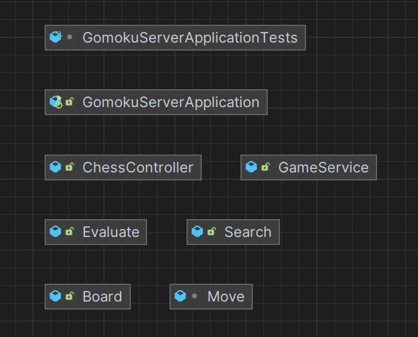
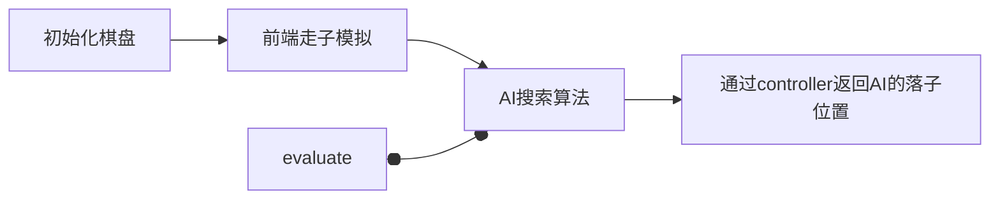

## 1. 项目架构



| 模块 | 作用 |
| :----: | :----: |
| GomokuServerApplication | SpringBoot的启动类 |
| ChessController | 处理前端的请求 |
| GameService | 处理游戏逻辑 |
| Board | 棋盘类 |
| Evaluate | 评估函数 |
| Search | 搜索算法 |

## 2. 接收数据
当前端发来请求时，Controller先解析数据，ChessController会调用GameService的方法，GameService会调用Board、Evaluate和Search的方法，最后返回结果给ChessController，ChessController再返回给前端。  

cheeseController需要两个修饰器，一个是`@RestController`，一个是`@CrossOrigin`，前者表示这个类是一个控制器，后者表示允许跨域请求。

```java
@RestController
@CrossOrigin(origins = "http://localhost:5173") // 允许前端端口的跨域请求
```

定义一个@RequestBody，用来接收前端发来的数据，这个数据是一个json格式的数据，包含了前端的落子位置和棋盘的状态。自定义一个Move类用于匹配json数据，这个类包含了两个属性，一个是落子位置，一个是棋子种类

```java

class Move {
    private int x;
    private int y;
    private int role; // 人类白棋，1为白棋，2为黑棋（AI）

    public int[] getPos() {
        int[] pos = new int[2];
        pos[0] = this.x;
        pos[1] = this.y;
        return pos;
    }
    public int getRole() {
        return this.role;
    }

   public void setPos(int x,int y){
        this.x = x;
        this.y = y;
   }
    public void setX(int x) {
        this.x = x;
    }

    public void setY(int y) {
        this.y = y;
    }
    public void setRole(int role) {
        this.role = role;
    }
}
```

## 3. 处理数据
在处理游戏逻辑时，专门新开了了一个service，这样做的好处是，可以将游戏逻辑和控制器分开，使得代码更加清晰。  
在游戏逻辑里，步骤如下

具体的算法部分在[Algorithnm](./Algorithm/)目录里