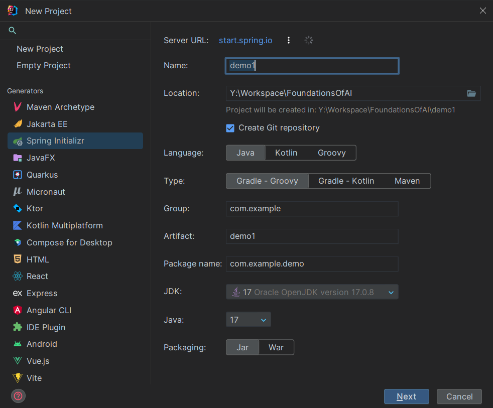

## 1. IntelliJ




选项解释  
1. Generator: 生成器，它的作用是生成一个项目的基本结构，这里选择Spring Initializer，即Spring的初始化器，它可以帮助我们快速的创建一个Spring项目。提前新建一些属于Spring的文件夹，以及一些基本的配置文件。
2. Name: 项目名称，下面的Artifact会随之更改
3. Language: 项目语言，三种语言的优缺点
   | 语言 | 优点 | 缺点 |
    | :---- | :---- | :---- |
    | Java | 1. 语法简单，易于学习 </br>2. 语言特性丰富，功能强大 </br>3. 语言规范统一，有大量的第三方库支持 | 1. 语言本身臃肿，代码量大 </br>2. 语言特性过于丰富，学习成本高 |
    | Kotlin | 1. 语法简洁，代码量少 </br>2. 语言特性丰富，功能强大 </br>3. 语言规范统一，有大量的第三方库支持 | 1. 语言本身臃肿，代码量大 </br>2. 语言特性过于丰富，学习成本高 |
    | Scala | 1. 语法简洁，代码量少 </br>2. 语言特性丰富，功能强大 </br>3. 语言规范统一，有大量的第三方库支持 | 1. 语言本身臃肿，代码量大 </br>2. 语言特性过于丰富，学习成本高 |
4. Group: 项目组织，一般是公司的域名倒序，比如com.tongji

## 2. 项目结构

空项目的目录如下
```bash
.
|-- mvnw
|-- mvnw.cmd
|-- pom.xml
|-- src
|   |-- main
|   |   |-- java
|   |   |   `-- com
|   |   |       `-- tongji
|   |   |           `-- gomokuserver
|   |   `-- resources
|   |       |-- application.properties
|   |       |-- static
|   |       `-- templates
|   `-- test
|       `-- java
|           `-- com
|               `-- tongji
|                   `-- gomokuserver
`-- target
    |-- classes
    |-- generated-sources
```

程序的入口再`src/main/java/com/tongji/gomokuserver/GomokuServerApplication.java`中，这个类是一个SpringBoot的启动类，SpringBoot的启动类必须要有`@SpringBootApplication`注解，这个注解包含了`@Configuration`、`@EnableAutoConfiguration`、`@ComponentScan`三个注解，分别代表了配置、自动配置和组件扫描。SpringBoot的启动类必须放在项目的根目录下，否则SpringBoot无法扫描到。
